# C语言实现基于RISC-V指令集的CPU控制器仿真 （以8的阶乘为例）
#### 特殊说明：
###### 1.文档中使用的RISC-V 指令编码器/解码器 网址为：https://luplab.gitlab.io/rvcodecjs/#q=0xFE311FE3&abi=false&isa=RV32I 
###### 2.设计思路伪代码为：
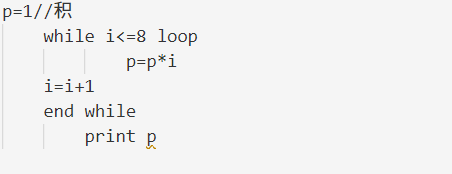
## 一、数据结构
#### 1.对内存大小，寄存器,内存数量 进行宏定义，定义程序计数器和停止标志的初始值

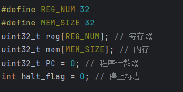
### 2.ALU所需指令的枚举
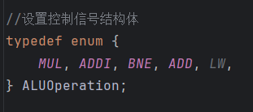
### 3.定义控制信号的结构体
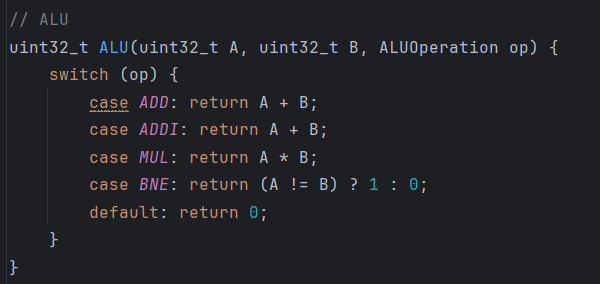
## 二、指令循环
### 4.取指令部分

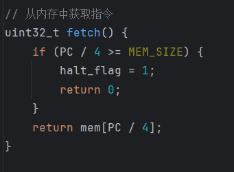
#### 返回1个32位无符号整数（unsigned int型），用if语句做越界判断。

### 5.指令译码（关键）
#### 5.1提取操作码，功能码，寄存器编号，处理立即数的符号扩展
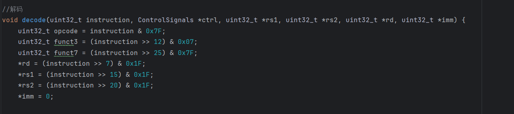
#### RISC-V指令集：
#### 操作码opcode：7位（第0位-第6位）
#### funt7功能码：6位（第25位-第31位），  funt3功能码：3位（第12位-第14位）。
#### 寄存器编号：5位（分为rs1，rs2，rd三类寄存器），  立即数：12位。
#### 程序所用的LW，ADDI是I型指令；MUL是R型指令；BNE是B型指令。 
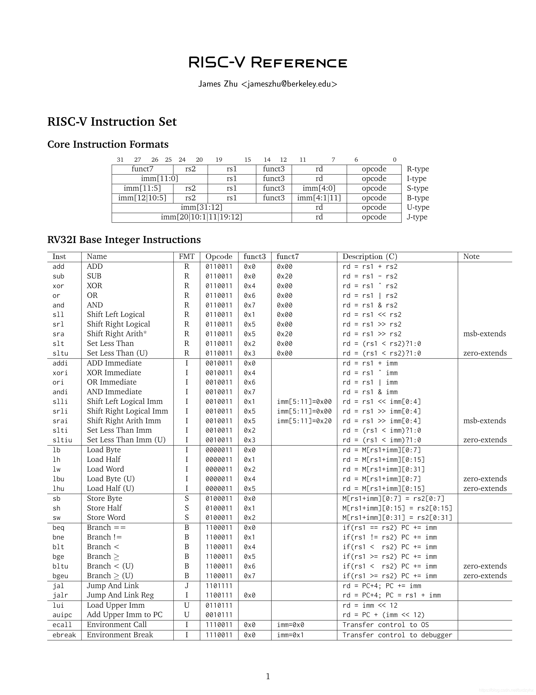

#### 5.2初始化控制信号（更新）
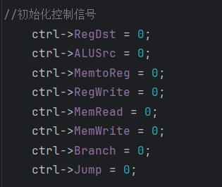
##### LW指令
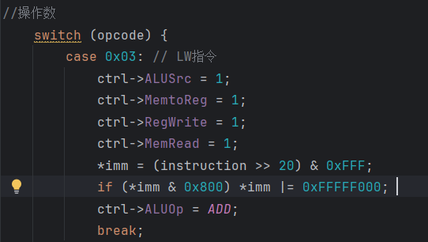

##### 将内存中地址为 40（R0 + 40）的数据加载到寄存器 R1 中。(寄存器R0值恒为0)
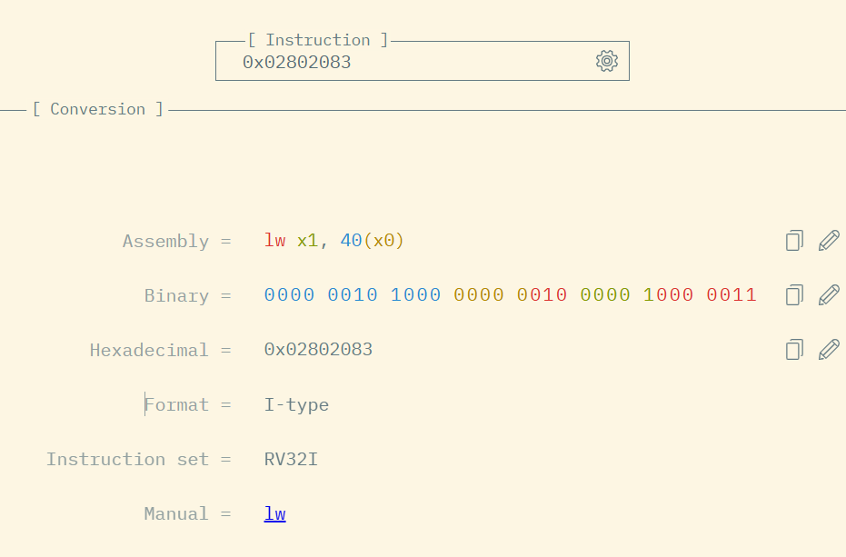

##### 将内存中地址为 44（R0 + 44）的数据加载到寄存器 R2 中。
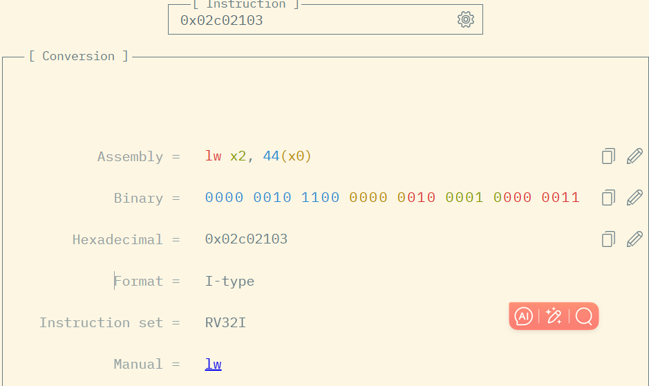

##### 将内存中地址为 48（R0 + 48）的数据加载到寄存器 R3 中。
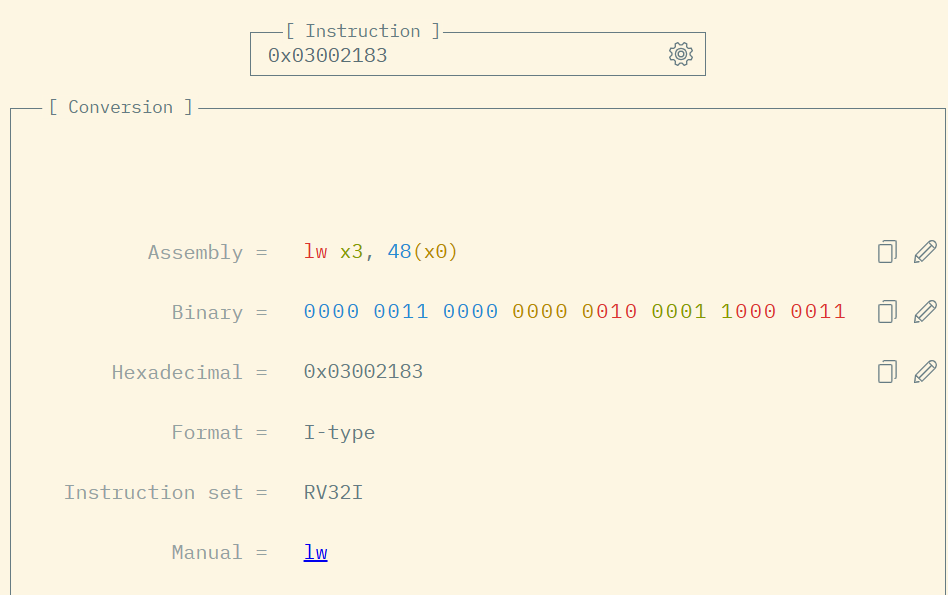

##### MUL指令
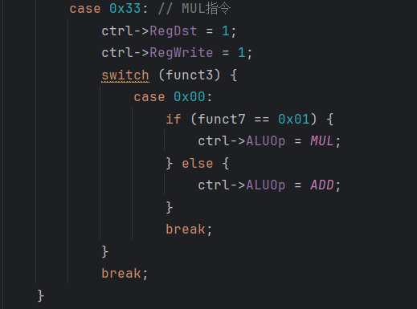
##### 将寄存器 R1 和 R2 的值相乘，并将结果存入寄存器 R1 中。
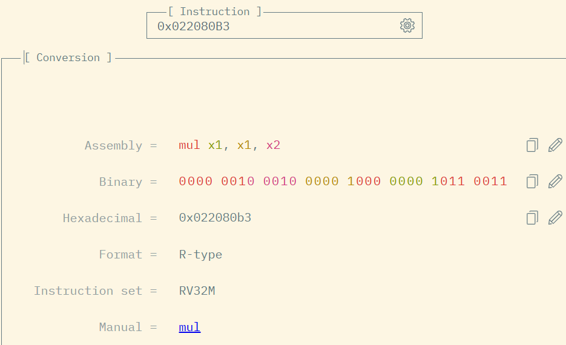

##### ADDI指令
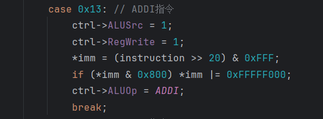
##### 将寄存器 R2 的值加上立即数 1，并将结果存入寄存器 R2 中
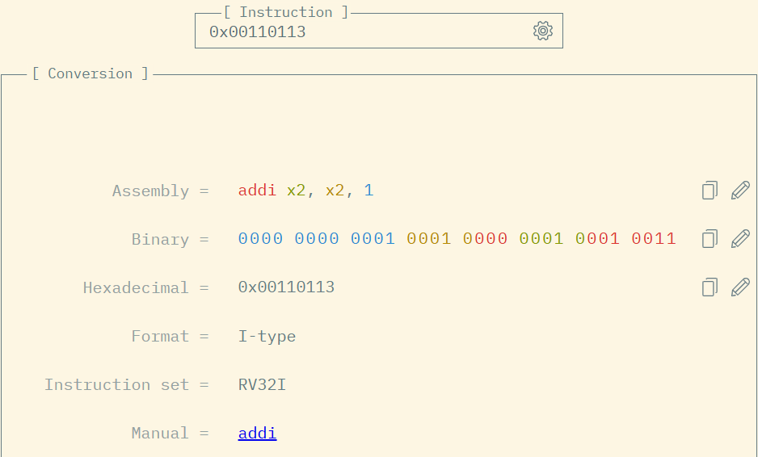

##### BNE指令
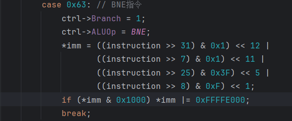
##### 如果寄存器R2!=R3，则跳转到当前指令前第 2 条指令执行。
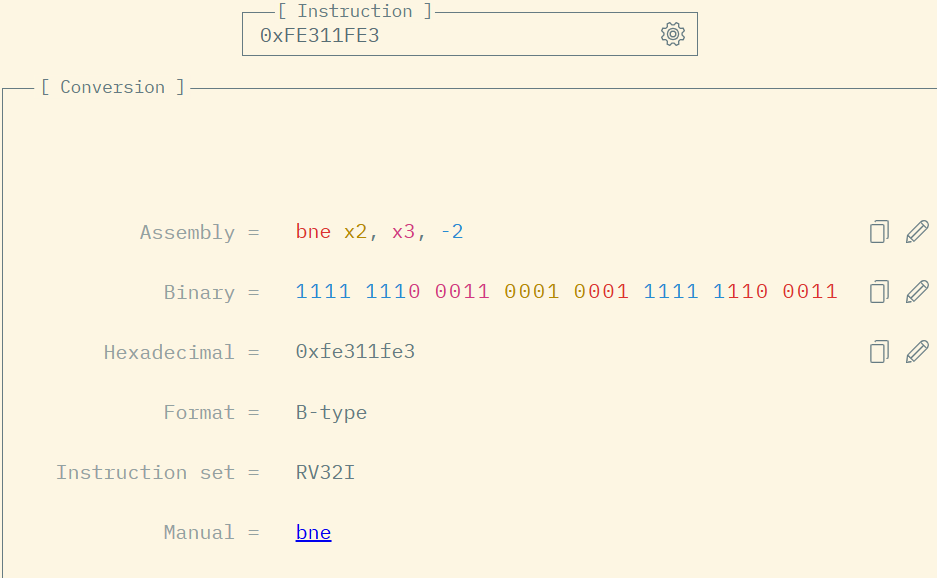

### 6.ALU实现

#### 依据操作码来实现对应运算

### 7.指令执行
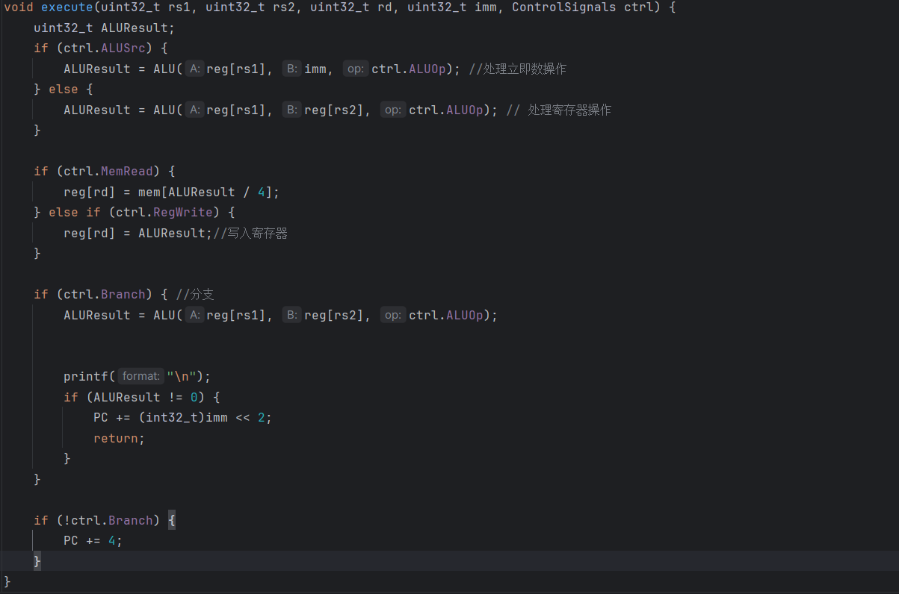
#### 根据指令译码生成的控制信号和寄存器值，执行相应的指令逻辑

### 8.输出寄存器的值
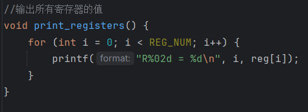

## 三、主函数
### 9. 主函数
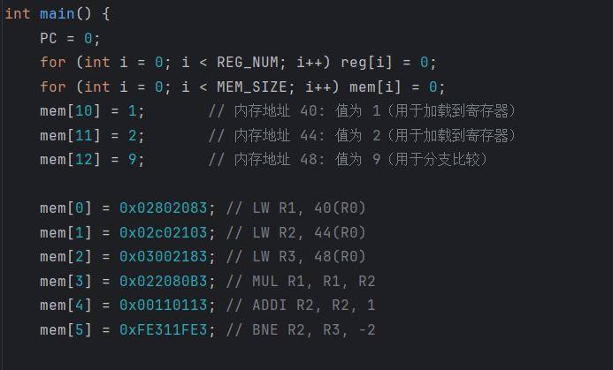
#### 主存和源寄存器，目的寄存器的初始化 
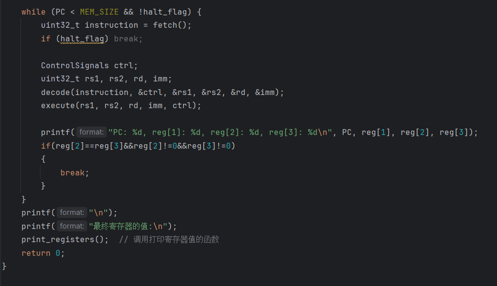
#### 在一个指令循环中执行取指令，译码，执行指令，指令跳转

## 四、测试与运行
### 10.CPU编译（F12）测试（F11）实现8！的阶乘计算
### 11.CPU运行结果
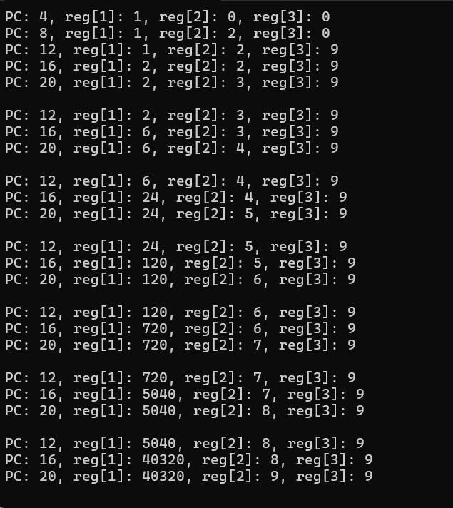

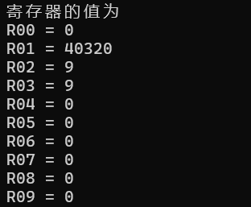
### 上图是实验全部的的运行测试答案
